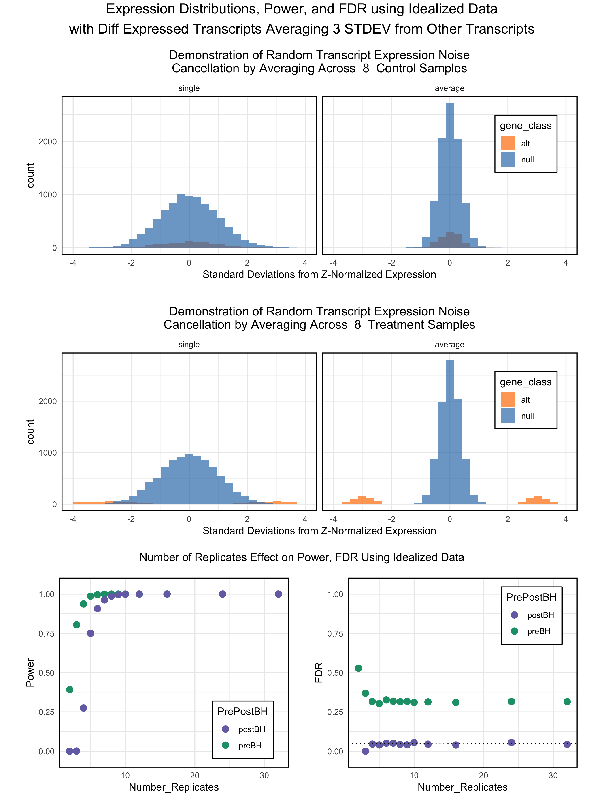

Effect of Sample Replicates on Statistical Power and False Discovery Rates Using Simulated RNA-Seq Data
================
Michael Kesling, michael dot kesling at alumni dot stanford <dot> edu

FDR, Power, and Benjamini-Hochberg
----------------------------------

### Motivation

As RNA-Seq experiments are time- and money-consuming, biologists typically want to reduce the number of samples processed in order to save resources.

Statisticians, on the other hand, know that the more data one has, the better one can see the signal through the noise. They also know that the biological variability between samples is large.

This document performs simulations of RNA-Seq experiments of increasing complexity so that the key metrics of Statistical Power and the False Discover Rate (FDR) can be measured as a function of the number of sample replicates.

Furthermore, it's widely known that in order to publish a list of transcripts, one needs to control the level of False Positives by adjusting the p-values of the transcripts. This is typically done using the Benjamini-Hochberg technique of converting p-values to q-values to correct for the multiple-testing problem that exists in RNA-Seq analysis. We therefore look at the metrics of Power and FDR both before and after the Benjamini-Hochberg (BH) correction as a function of the number of (biological) sample replicates.

### Power and FDR

Ideally, we'll be able to identify all the transcripts that are changing between control and treatment samples. In this simulation, we call these transcripts the **alt-transcripts** and the fraction of them that are correctly identified by us is the True Positive Rate (TPR), which is also known as the **Statistical Power**. When the Power is low, that means that many transcripts of interest were not identified. These transcripts are the False Negatives. So the higher the Power, the lower number of False Negatives.

In order to perform a good analysis, it's not only important to correctly identify the transcripts that are of interest (True Positives), but it's also important to not identify transcripts that are truely not changing between control and treatment samples. Doing so generates False Positives. One commonly-used metric for this is called the **False Discovery Rate (FDR)**. The FDR is the fraction of transcripts we predicted as being interesting that were, in fact, not changing.

So in order to have a successful study, we need both high Power and a low FDR.

### Simulation Procedure

We start off by generating simulated datasets, as in this case, we can define which transcripts don't change in their expression levels between the control and treatment samples--we call these transcripts 'null'--and which transcripts do--we call these transcripts 'alt' for 'alternative-hypothesis'.
That way, we have a definitive way of knowing exactly which transcripts are true positives (TP), False Negatives (FN), etc. All transcripts have expression levels that are the same between the various control samples and changes only occur between control and treatment samples. This simplifying assumption removes confounding factors (age, sex, family history) from the simulation's early stages.

At the beginning of this study, we start off using a simple normal distribution of transcripts, and later move to a more realistic distribution of transcripts.

Although transcripts can vary greatly in their basal expression level, it's the relative changes that occur from sample-to-sample that are generally of interest. So that the relative expression level of transcripts can be viewed easily on a single scale, we've Z-normalized each transcript according to its mean and standard deviation. A value of 0 is equal to a particular transcript's mean and a value of -1 is equal to 1 standard deviation of expression lower than its mean. The standard deviations are measured across the various control samples.

We start by defining the parameters of the study. These values (n, fracAlt, M, mu0, sd0, muA, sdA) can be modified by the user in the RMD document in RStudio. If the user is a beginner, then this is the only place changes are recommended.

``` r
###################
# Set user-defined parameters
n = 10000                                   # number of total transcripts
fracAlt = 0.1                               # fraction of tc's with condition=alt
M <- c(2, 3, 4, 5, 6, 7, 8, 9, 10, 12, 16, 24, 32) # varying # replicates per ctrl/trtmt
mu0 = 0                                     # null tc mean
sd0 = 1                                     # null tc sd
muA = 2                                     # alt tc mean
sdA = 1                                     # alt tc sd
###################

nA = round(n * fracAlt)                     # alt tc in DF
n0 = n - nA                                 # null tc in DF
```

I'm going to define a few functions that will be used in this study. The code for these functions, as well as most of the code, is viewable in the original .RMD file, but not in the .html report:

1.  createMultiSampleDF creates a dataframe of randomized data about a null mean or an alternative mean, depending on whether a gene has null-behavior or not. The dataframe varies in the number of samples depending on the parameter *m*
2.  FDR\_Power\_BH calculates the Power and FDR for the data frame, with and without the Benjamini-Hochberg (FDR) correction.
3.  printFdrPowerPlots. For every value of the gene-level average expression value in the 'treatment' samples, muA, it plots Power and FDR as a function of the number of sample replicates, m. The values of both Power and FDR are plotted before and after the Benjamini-Hochberg p-value correction.
4.  createHistNullAltGenes. This function creates 2 pair of histograms. The first pair looks at null genes (those that don't change in the study) and alt genes (those that do change) only in the controls samples. It shows the gene expression distribution in a single control sample and then averaged across m samples. The second pair of histograms does the same, but for 'treatment' samples where the 'alt' genes DO change (either up or down) by *m**u**A* STDEVs.

Our dataset contains *m* control and *m* experimental samples. *m* takes on the values defined in the variable M, which was defined above under the section "Set user-defined Parameters." With each value of *m*, we create a dataframe, which is analogous to a spreadsheet. From that dataframe, df, we calculate the pre- and post-BH values of Power and FDR. Each of these 4 values is saved to a list for later plotting.

We now print out the Power and the FDR as a function of m, the number of sample replicates. We'll also include the histogram of the null and 'alt' transcripts in the treatment samples as well as the same in the control samples.

``` r
# create the 4 histograms
title = paste0("Demonstration of Random Transcript Expression Noise
Cancellation by Averaging Across ")
x_lim = 4; m=8
gHist <- createHistNullAltGenes(nA, n0, fracAlt, m, mu0, muA, sd0, sdA, title, x_lim)

# create the Power vs Replicates and FDR vs Replicates Plots
title = "Number of Replicates Effect on Power, FDR Using Idealized Data"
grobs <- printFdrPowerPlots(powerL, powerAdjL, fdrL, fdrAdjL)
g2 <- arrangeGrob(grobs$pwr, grobs$fdr, ncol=2, top=title) 

# create the main title for the figure
main_title = paste0("Expression Distributions, Power, and FDR using Idealized Data\n", "with Diff Expressed Transcripts Averaging ", muA, " STDEV from Other Transcripts")

# arrange figures and print to document                    
suppressMessages(grid.arrange(gHist$control, gHist$treatment, g2,nrow=3,
                              top=textGrob(main_title, gp=gpar(fontsize=15))))
```


The alternative hypothesis 'alt' transcripts above are all of interest--whether or not they can be detected. Yet, they are all on the verge of significance on a per-gene level, as their average value in the "treatment" samples is either -2 STDEV or +2 STDEV from their "control" sample values. These should yield a p-value of exactly 0.05 given an unlimited number of samples which would overcome the noisiness of the data.

At the top of the figure, we see that the alt-transcripts, in orange, have the same distribution as the null-transcripts in blue as long as we're in a control sample.

We also see that the distribution becomes a lot tighter (smaller standard deviation) if we take the average across 8 control samples rather than just the distribution of transcript expression level for a single sample. This is the well known Central Limit Theorem (CLT) of statistics in action. It works because as one averages values, the random noise in the data tend to cancel each other out across samples and it becomes easier to see the signal over the noise.

We're plotting before-and-after-averaging histograms in order to underscore why sample replicate number gives us better data discrimination with respect to Power and FDR at the bottom of the figure.

The middle pair of panels show the distribution of a single 'treatment' sample and the averaging of 8 treatment samples for the set of transcripts. We see the same thing as at the top, except we notice that the alt-transcripts expression is centered around either -2 or +2 standard deviations from the mean, as these are the transcripts whose expression levels are changing.

In the bottom pair of panels, we notice several things. First, the FDR never really gets below about 30% unless we correct it using Benjamini-Hochberg. The reason for this has to do with the fact that there are many more transcripts (9000) that are not changing between control and treatment samples compared to the number that are changing (1000). Using an uncorrected p-value cutoff of 0.05 (preBH), we would expect to incorrectly identify 9000 \* 0.05 = 450 false-positive transcripts, along with the 1000 true-positive transcripts (assuming sufficient power) giving a FDR of approximately 450/1450 = 31%.

This means that when the total number of truly changing transcripts is much smaller than the number of transcripts that are not changing, we will need BH or a similar method to convert our p-values to q-values in order to maintain a reasonable FDR.

While FDR can be controlled using BH even with small numbers of sample replicates, statistical power remains low until, say, we use at least 7 control samples and 7 treatment samples, at which the majority of these transcripts can be found (power &gt; 0.50). And this is using idealized data which has less biological noise than most real-life studies.

This simulation implies that the transcripts reported in journals as having a FDR &lt;= 0.05 will have expression levels that vary between the treatment and control samples more than 2 STDEVs from their control means (unless the number of replicates, m, is high).

Next, we'll repeat the above analysis, but setting 'alt' transcripts as having a -3 or +3 STDEV mean in the 'treatment' samples.

``` r
### Set new mean of alt-transcripts
muA = 3
```

``` r
title = paste0("Demonstration of Random Transcript Expression Noise
Cancellation by Averaging Across ")
x_lim = 4
m=8
gHist <- createHistNullAltGenes(nA, n0, fracAlt, m, mu0, muA, sd0, sdA, title, x_lim)

title = "Number of Replicates Effect on Power, FDR Using Idealized Data"
grobs <- printFdrPowerPlots(powerL, powerAdjL, fdrL, fdrAdjL)
g2 <- arrangeGrob(grobs$pwr, grobs$fdr, ncol=2, top=title) 

main_title = paste0("Expression Distributions, Power, and FDR using Idealized Data\n", "with Diff Expressed Transcripts Averaging ", muA, " STDEV from Other Transcripts")
                    
suppressMessages(grid.arrange(gHist$control, gHist$treatment, g2, nrow=3,
                              top=textGrob(main_title, gp=gpar(fontsize=15))))
```

 Now that we're looking at transcripts that change more substantially between treatment and controls samples, we see that we get good Power/FDR Performance with a few less sample replicates.

This fact is due to better separation between the null-transcripts and the alt-transcripts, as viewed in the pair of histograms in the middle panel.

We see that even with only 5 sample replicates each, we're seeing a post-Benjamini- Hochberg corrected FDR such that about 50% of the genes are true positives. This will give a good number of genes to analyze in a research publication, but we also see that going to 6 or sample replicates each improves the post-BH power substantially.

With sample replicates of 4 each (control/treatment), there should be a good number of transcripts to report on. 3 replicates each will limit us to transcripts that vary even more between sample type.

Again, up until this point, we've been using idealized data. Real-life samples will require a greater number of replicates, and we explore this below.
