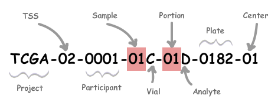

```{r setup, include=FALSE}
knitr::opts_chunk$set(echo = TRUE)

```
### Introduction

In order to correctly select the pertinent RNA-Seq samples from The Cancer Genome Atlas (TCGA) project, it's necessary to access attribute data about the samples from the NCI's Genomic Data Commons (GDC), where the data are now warehoused (https://gdc.cancer.gov).

A Bioconductor package named 'GenomicDataCommons' is utilized here in order to explore and
then extract the relevant fields of sample attributes.  The 'BiocManager' package must first be
installed in order to install bioconductor packages.

#### Note:
Some of the code is not shown on the GitHub website.  One needs to look at the [R Markdown file](https://github.com/keslingmj/RNASeq/blob/master/GDC_Sample_Attribute_Extraction.Rmd) to view all of the code.

```{r, include=FALSE}
# BiocManager::install('GenomicDataCommons')     # already installed on my machine
suppressMessages(require(GenomicDataCommons))
suppressMessages(require(knitr))
suppressMessages(require(dplyr))
options(tibble.width = Inf)
```
  
### Understanding TCGA Identifiers

Each RNA-Seq file that was generated by TCGA, whether it was obtained directly through GDC,
from the [Wang publication](https://www.nature.com/articles/sdata201861.pdf) of cross-study normalized data, or other studies, is identified through its TCGA identifier.  This identifier gives important information regarding the type of sample used, and is essential for mapping attribute data on GDC to other published studies.  

We'll look at the structure of the TCGA identifier to determine what information we need to uniquely identify a human patient.



```{r, echo=FALSE}
tcgaDF <- read.csv("TCGA_Table.tsv", sep="\t")
knitr::kable(tcgaDF, table.attr="style='width:70%;'")  # adjust width some other way
```
  
While other fields in the TCGA identifier may be important, the "TSS", "Participant", and "Sample" fields are sufficient for identifying the desired sample attributes of individual patients on GDC.  

### Exploring GDC Sample Attributes

We using the [Vignette for the GenomicDataCommons package](https://bioconductor.org/packages/release/bioc/vignettes/GenomicDataCommons/inst/doc/overview.html) to explore and query the GDC data.

As the sample attributes of *Demographics* (characteristics of the human patient such as age, sex, race, etc.) and *Diagnoses* (characteristics of the tumor/healthy sample such as stage of cancer, new diagnosis/recurrence, etc.) all fall under the umbrella of the *cases*, we'll access our data through the *GenomicDataCommons* function *cases()*.

Let's start out by simply asking how many different *cases* are stored by GDC:
```{r}
GenomicDataCommons::cases() %>% GenomicDataCommons::count()
```
We see that there are over 34,000 cases as of July 2019.  

### Identifying Breast Cancer Project ID
As we're focusing on breast cancer, and the samples are grouped into projects according to the type of cancer, we'll need to determine the correct identifier for subsetting all cases by those involving breast cancer.

First, we need to determine the exact field and identifier for the *Project ID*.  We'll use the *grep()* function to try and find that field.
```{r}
project_fields <- grep('proj', available_fields('cases'), value=TRUE)
print(project_fields)
```
It appears that the exact field name is *project.project_id*.
Let's determine what value a project ID would have for a breast cancer sample.
```{r}
projClasses <- cases() %>%
   facet('project.project_id') %>%  
   aggregations()
head(projClasses$project.project_id)
```
We can see that one of the most popular entries under 'project_id' is 'TCGA-BRCA', giving 1098 cases of breast cancer as of July 2019.  We will focus on this dataset going forward.  

### Identifying TCGA identifier and Downloading Sample Data
We need to ensure that for the breast cancer sample attributes we download, that there is a TCGA ID related to the case number.  We'll need that for identifying the right RNA-Seq identifiers in other publications later on.

The 'case_id' is needed for joining data across tables or object, but its format is not in the TCGA
format.  e.g. `87b85935-a058-44ad-8fb6-8511130eaffe`

We start by figuring out what the 'sample_id' might be called in GDC. We'll use *grep()* for this:
```{r}
sample_fields <- grep('sample_id', available_fields('cases'), value=TRUE)
print(sample_fields)
```
More than one identifier will serve our purpose, as long as it begins with *TCGA*, and contains the *TSS*, *Participant*, and *Sample* fields.
Based on iterating through this code previously, it was found that *submitter_sample_ids* will suffice for our purpose, as shown with the following code.  We are going to pull all the sample attribute data that we'll need, and we'll look at it step-by-step below, starting with the *submitter_sample_ids*.
```{r}
expands = c("diagnoses","annotations",
            "demographic","exposures")
brcaResults <- cases() %>%
   GenomicDataCommons::filter(~ project.project_id == 'TCGA-BRCA') %>%
   GenomicDataCommons::select("submitter_sample_ids") %>%
   GenomicDataCommons::expand(expands)   %>%
   response_all()

print(c("`f06f09f3-8133-4a92-ac86-fbe64295e0d8` ->", (list(brcaResults$results$submitter_sample_ids$`f06f09f3-8133-4a92-ac86-fbe64295e0d8`))))
```
We see that the *TSS*, *Participant*, and *Sample* fields are present in these *submitter_sample_ids*.    
• The *case_id* begins with 'f06f...'  
• We see that it maps to 4 distinct *submitter_sample_id*s.  Each one begins with 'TCGA-E9-A1ND'.  
• "E9" is the code for the "Breast Invasive Carcinoma" study at the Asterand Biosciences.  
• "A1ND" is the patient/participant code for that study.  We notice that these values are the same for all 4 *submitter_sample_id* codes, which says that all 4 samples were generated from the same patient.  
• 2 of the sample_code fields are "01Z" and "01A".  "01"" refers to a "Primary Solid Tumor", and A and Z refer to the fact that these are 2 separate samples.  I assume that are labeled A and Z (rather than A and B) because they are the 1st and 2nd Primary Solid Tumors out of a total of 2 (rather than the 1st and 2nd out of several).  
• We also notice that this patient has 2 other samples whose sample type is 10 = "Blood-Derived Normal Cell" and 11 = "Solid Tissue Normal".  That means that 2 non-cancerous controls were taken from this patient, in addition to the 2 primary solid tumor samples taken.  

### Exploring *brcaResults* Data Object
brcaResults is the name of the GDCcasesResponse object, which is fundamentally a list, that was returned from the data query to GDC.
We'd like to understand how the *demographic*, *diagnoses*, *exposure*, and *annotations* objects are organized.
```{r}
dem <- class(brcaResults$results$demographic)
diag <- class(brcaResults$results$diagnoses)
annot <- class(brcaResults$results$annotations)
exp <- class(brcaResults$results$exposures) 
print(c("demographic ->", dem, "diagnostic ->", diag, "exposures -> ", exp, "annotations -> ", annot))
```
We can see that *demographic* is a data frame. (It contains the demographic data directly.)
Right now, we'll explore how the *annotations* and *diagnoses* lists are laid out, and how sparse they are.

```{r}
lists <- c("brcaResults$results$annotations", "brcaResults$results$diagnoses")
for(listName in lists){
   numAnnotNull <- 0
   resNum <- 0
   for(result in eval(parse(text=listName))){
      resNum = resNum+ 1
      if(is.null(result)){
         numAnnotNull = numAnnotNull + 1
      }
   }
   print(paste("The fraction of ", listName, " records that are empty is ", numAnnotNull/resNum))
}

```
Clearly, the *annotations* list is almost completely empty, so we'll want to ignore it for this work, while the *diagnoses* list is almost entirely populated and we'll want to use it.

The structure of the *exposures* list of dataframes is a bit different, as empty fields are still populated with a header.  Let's see how well it's populated:
```{r}
fields <- c("cigarettes_per_day", "alcohol_intensity", "bmi", "years_smoked")

numAnnotNull <- 0
resNum <- 0
for(result in brcaResults$results$exposures){
   if(!is.null(result)){
      resNum = resNum + 1
      if(all(is.na(result[fields])) & result$alcohol_history=="Not Reported"){
         numAnnotNull = numAnnotNull + 1
      }
   }
}
print(paste("The fraction of the exposures records that are empty is ", numAnnotNull/resNum))
```
So clearly the *exposures* list has no useful information.  

### Selecting Relevant Fields in *demographic* and *diagnoses* data objects
Now that we've decided to not use the *annotations* and *exposures* data lists, we'll see what fields in the *demographic* and *diagnoses* objects we might be interested in.  

Let's see what fields are available in the *demographic* data frame:
```{r}
colnames(brcaResults$results$demographic)
```
As we're interested in characteristics about the patients and not the time when the data were entered into the GDC database, we'll subset these fields and look at the first few rows in tibble format.
```{r}
importantDemographicFields <- c("gender", "race", "days_to_birth", "ethnicity", 
                                "vital_status", "age_at_index", "days_to_death", 
                                "year_of_birth", "year_of_death")
brcaData1098 <- brcaResults$results$demographic[importantDemographicFields]
brcaData1098 <- cbind(rownames(brcaData1098), brcaData1098)
colnames(brcaData1098) <- c("sampleId", importantDemographicFields)
brcaData1098 <- as_tibble(brcaData1098)
head(brcaData1098, n=4)
```
We can see that these selected fields are all important, and we can also deduce that "age_at_index" refers to the age at which the patient was diagnosed with breast cancer.  The 4th patient in the output above was born in 1921, was 73 years old at "age_at_index", had 3126 days_to_death (3126/365=8.5 years), and died in 2002.  1921 + 73 + 8.5 = 2002.5.  

#### Now let's look at what fields in the *diagnoses* list of dataframes might be of interest.
```{r}
colnames(brcaResults$results$diagnoses$`87b85935-a058-44ad-8fb6-8511130eaffe`)
```
Of these *diagnoses* fields, we'll use the following:  
"primary_diagnosis",  
"tumor_stage",  
"age_at_diagnosis",  
"morphology",  
"prior_treatment",  
"tissue_or_organ_of_origin",  
"prior_malignancy".  

'tumor_grade' is not reported,  'icd_10_code' is always C50.9 (invasive breast cancer), and "days_to_recurrence" is always NA, so they won't be used.
```{r}
importantDiagnosisFields <- c("primary_diagnosis", "tumor_stage", "age_at_diagnosis", 
                              "morphology", "prior_treatment",  "tissue_or_organ_of_origin", 
                              "prior_malignancy")

brcaSampleIDs1098 <- names(brcaResults$results$diagnoses)

diagnostics <- brcaResults$results$diagnoses[[brcaSampleIDs1098[1]]][importantDiagnosisFields]
sampleId <- c(brcaSampleIDs1098[[1]])
for(id in brcaSampleIDs1098[2:length(brcaSampleIDs1098)]){
   record <- brcaResults$results$diagnoses[[id]][importantDiagnosisFields]
   if(!is.null(record)){                                   # handles NULL record
      diagnostics <- rbind(diagnostics, record)
      sampleId <- c(sampleId, id)
   }
}
diagnostics <- cbind(sampleId, diagnostics)
diagnostics <- as_tibble(diagnostics)          
```
  
### Joining together the 2 Tibbles
We'll now want to join together all the columns from the *brcaData1098* tibble, which contains the demographic attributes of interest, and the *diagnostics* tibble, which contains the cancer tumor (or healthy sample) attributes of interest.
```{r}
suppressWarnings(brcaSampleData1097 <- inner_join(brcaData1098, diagnostics))
```
As there was a record that existed in *demographics* that did not exist in *diagnoses*, that row was removed, bringing the number of patients in our full breast cancer dataset to 1097.  The Tibble storing the data is called *brcaSampleData1097*.  

### Adding TCGA Identifiers to Dataframe
One other piece of information we'll need is to add on the list of TCGA IDs associated with each sampleId.
```{r}
# set up first row of expanded data frame/tibble:
smpId <- as.character(brcaSampleData1097[1,"sampleId"])
tcgaId <- brcaResults$results$submitter_sample_ids[smpId]
tmp <- cbind(brcaSampleData1097[1,], paste(unlist(tcgaId), collapse=";")) #tmp dataframe

# loop through other rows and add them
for(i in 2:dim(brcaSampleData1097)[1]){
   smpId <- as.character(brcaSampleData1097[i,"sampleId"])
   tcgaId <- brcaResults$results$submitter_sample_ids[smpId]
   tmp <- rbind(tmp, cbind(brcaSampleData1097[i,], paste(unlist(tcgaId), collapse=";")))
}

# add new column name, convert to tibble and print first 4 rows:
names(tmp)[names(tmp) == 'paste(unlist(tcgaId), collapse = ";")'] <- 'tcgaID'
brcaSampleData1097 <- as_tibble(tmp)
head(brcaSampleData1097, n=4)
```
### Exporting Full Set of Breast Cancer Sample Attributes
As part of our work, we'll want to work on the full set of breast cancer samples.  So we'll export the *brcaSampleData1097* data frame at this point for later use.
```{r}
write.table(brcaSampleData1097, "TCGA_Attributes_full.txt", sep="\t", row.names = FALSE)
```
### Exploring Sub-Classes of Breast cancer
For some work we'll do on data simulation, we'll subset the full attribute data frame to those having specific attributes.  

We select out only those cases that are breast cancer and see what data are available to us:

```{r}
cases() %>%
   GenomicDataCommons::filter( ~ project.project_id == 'TCGA-BRCA') %>%   # '~' needed
   facet('disease_type') %>%
   aggregations() %>%
   head()
```
We see that 'Ductal and Lobular Neoplasms' cover almost all cases.  Analysis of the most common values in the field *primary_diagnosis* shows that 778 samples have the specific diagnosis "Infiltrating duct carcinoma, NOS" (see below).  

```{r}
tbl <- table(brcaSampleData1097$primary_diagnosis)
kable(head(sort(tbl, decreasing=TRUE), n=5))
```

### Subsetting Samples
In an analysis being performed modeling healthy and tumor samples, limitations are being placed on which samples will be used to reduced confounding.

From the full *brcaSampleData1097* breast cancer dataset, we'll filter out:  
(a) those samples that are not 'Infiltrating duct carcinoma, NOS'  
(b) men (12 samples in total)  
(c) those from women not between ages 40-49 at the time of diagnosis  
(d) those that have previous treatments or previous diagnoses  
(e) those from women who are not white and those who are Latino  

```{r}
brcaDuctF40W_86 <- brcaSampleData1097 %>%                       # start with 1097 samples
   dplyr::filter(primary_diagnosis=='Infiltrating duct carcinoma, NOS') %>% # 778 remaining
   dplyr::filter(gender=="female") %>%                                      # 767 remaining
   dplyr::filter(age_at_index >= 40 & age_at_index < 50) %>%                # 159 remaining
   dplyr::filter(race=="white") %>%                                         # 100 remaining
   dplyr::filter(ethnicity=="not hispanic or latino")                       #  86 remaining
```
  
### Writing Desired Attributes to a File
We will write the brcaDuctF40W_86 dataframe to a corresponding file.
```{r}
write.table(brcaDuctF40W_86, "brcaDuctF40W_86.txt", sep="\t", row.names=FALSE)
```

This file can now be used to study samples from various studies.

A helpful link regarding the TCGA Categories and values can be found [here](https://docs.gdc.cancer.gov/Data_Dictionary/viewer/).


